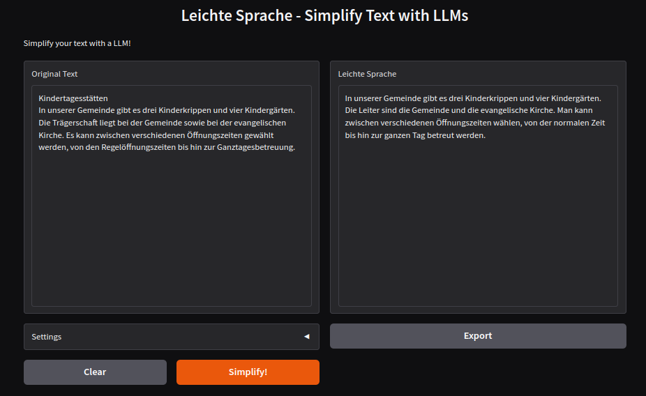

[](https://hpi.de/en/research/hpi-data-center/ai-service-center/)

# Leichte Sprache

## Simplify German language!

Locally-run tool to simplify German into "Leichte Sprache" (easy language) based on Large Language Models (LLMs).



The browser interface is designed for intuitive use, allowing different models and approaches to be experimented with. 
The implementation focuses on simplicity, low-level components and modularity, allowing developers and Python enthusiasts to modify and build upon.

### Installation

#### Install the basic tool

Download or clone the repository.

On bash, you can run the following installation script:

```shell
$ bin/install.sh
```

---

**Alternatively, install it manually:**

#### Create and activate a virtual environment (optional)

```shell
$ python3 -m venv .myvenv
$ source .myvenv/bin/activate
```

#### Install dependencies

```shell
$ pip3 install -r requirements.txt
```

##### Ollama

Install it to run large language models locally

```shell
$ curl -fsSL https://ollama.ai/install.sh | sh
```

Or follow the installation instructions for your operating system: [Install Ollama](https://ollama.com/download)

---
##### Model Set-Up

**With the repository and Ollama installed you need to Pull/Download the basic models and create the customized versions:**

On bash, you can run the following installation script:

```shell
$ bin/set-up-models.sh
```

**Or, manually:**

Pull the basic models:

```shell
$ ollama pull llama3.1
$ ollama pull llama3.2
```

Create the customized versions:

```shell
$ ollama create llama3.2-leichte-sprache:basic -f config/custom_model/Modelfile_llama32_LS_basic
$ ollama create llama3.2-leichte-sprache:fs -f config/custom_model/Modelfile_llama32_LS_fs
$ ollama create llama3.1-leichte-sprache:basic -f config/custom_model/Modelfile_llama31_LS_basic
$ ollama create llama3.1-leichte-sprache:fs -f config/custom_model/Modelfile_llama31_LS_fs
```

Pull the fined-tuned models:

```shell
$ ollama pull kisz/llama3.2-leichte-sprache-ft:latest
$ ollama pull kisz/llama3.1-leichte-sprache-ft:latest
```

---

### Usage

- Start the tool [*]

```shell
$ python3 app.py
```

- Open the provided URL on your web browser
- Write or paste a text to simplify
- Enjoy

### Key Settings

- **Model**: Select the desired [Model](docs/info_models_versions.md)
- **Use Rules** (checkbox): Click for adding Leichte Sprache rules to the prompt sent to the LLM. 

#### Additional Input parameters for the LLMs

- Top k: Ranks the output tokens in descending order of probability, selects the first k tokens to create a new distribution, and it samples the output from it. Higher values result in more diverse answers, and lower values will produce more conservative answers.

- Temp: This affects the “randomness” of the answers  by scaling the probability distribution of the output elements. Increasing the temperature will make the model answer more creatively.

---

[*] If you chose the installation with a virtual environment, remember to activate it before starting the application by running ```$ source .myvenv/bin/activate```

Performance consideration: On notebooks/PCs with dedicated GPUs, all the  set models should run properly and fast. On a standard notebook,  or if you encounter any memory of performance issues, prioritize the models based on llama 3.2 as they are smaller than the models based on llama 3.1 and need less hardware requirements.

---

## Development

Before committing, format the code using Black:

```shell
$ black -t py311 -S -l 99 .
```

Linters:

- Pylance
- flake8 (args: --max-line-length=100 --extend-ignore=E401,E501,E741)


For more detailed logging, set the `LOG_LEVEL` environment variable:

```shell
$ export LOG_LEVEL='DEBUG'
```
---

## License

[GPLv3](./LICENSE)
