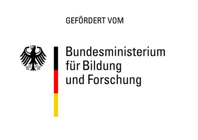

| [](https://hpi.de/en/research/hpi-data-center/ai-service-center/) | [](https://www.digital-agentur.de/)    |
| --- | --- |

# Leichte Sprache

## Simplify German language!

Locally-run tool to simplify German into "Leichte Sprache" (easy language) based on Large Language Models (LLMs).


The browser interface is designed for intuitive use, allowing experimentation with different models and approaches. The implementation focuses on simplicity, low-level components and modularity, allowing developers and Python enthusiasts to modify and build upon.

  Key Features
  - Simplifies complex German text into easy-to-understand language
  - Browser-based interface for intuitive usage
  - Local execution for privacy and control
  - Configurable parameters for output customization

### Installation

#### Install the basic tool

Download or clone the repository.

Follow the [installation instructions](docs/installation.md)

---

## Frontend Variants

Two different frontends are available in this expanded version of the repository:

- app.py – A simplified frontend for use by users without prior technical knowledge.
- app-Front-technisch.py – An advanced frontend for technical developers with access to advanced settings and test scenarios.

Both frontends use the same backend logic but differ in structure and presentation. Switching between the two versions is done by calling the correct file in the terminal with the following command

```shell
$ python3 [name-of-file].py
```

### Usage

- Start the tool [\*]

```shell
$ python3 [name-of-file].py
```

- Open the provided URL on your web browser
- Write or paste a text to simplify
- Enjoy

### Key Settings

- **Model**: Select the desired [Model](docs/info_models_versions.md)
- **Use Rules** (checkbox): Click for adding Leichte Sprache rules to the prompt sent to the LLM. 

#### Additional Input parameters for the LLMs

- Top k: Ranks the output tokens in descending order of probability, selects the first k tokens to create a new distribution, and it samples the output from it. Higher values result in more diverse answers, and lower values will produce more conservative answers.

- Temp: This affects the “randomness” of the answers  by scaling the probability distribution of the output elements. Increasing the temperature will make the model answer more creatively.

---

[\*] If you chose the installation with a virtual environment, remember to activate it before starting the application by running ```$ source .myvenv/bin/activate```

Performance consideration: On notebooks/PCs with dedicated GPUs, all the set models should run properly and fast. On a standard notebook, or if you encounter any memory or performance issues, prioritize the models based on llama 3.2 as they are smaller than the models based on llama 3.1 and need less hardware requirements.

---

## Extra Tools

 There are additional [command line input tools](docs/extra_tools.md) that you can use to batch process data.

---

## Development

Before committing, format the code using Black:

```shell
$ black -t py311 -S -l 99 .
```

Linters:

- Pylance
- flake8 (args: --max-line-length=100 --extend-ignore=E401,E501,E741)


For more detailed logging, set the `LOG_LEVEL` environment variable:

```shell
$ export LOG_LEVEL='DEBUG'
```
---

## Author
- [Joaquin Gomez Prats](https://github.com/slovanos)

## License
[GPLv3](./LICENSE)

---

 

This is an artefact from a collaboration between DigitalAgentur Brandenburg and KI-Servicezentrum Berlin-Brandenburg. DigitalAgentur Brandenburg is funded by the Ministry for Economic Affairs, Labour and Energy of the State of Brandenburg. KI-Servicezentrum Berlin-Brandenburg is funded by the Federal Ministry of Education and Research under the funding code 01IS22092.
